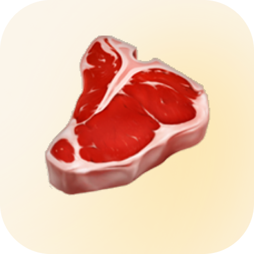
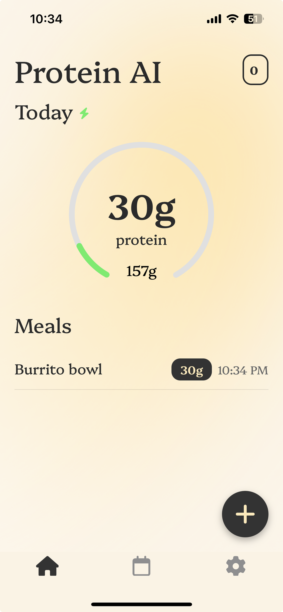

<p align="center">
  
</p>

<h1 align="center">Protein AI</h1>

<p align="center">
  <strong>AI-powered protein tracking that actually works.</strong><br/>
  Snap a photo of your meal, get instant protein estimates, and build lasting habits.
</p>

<p align="center">
  
  
  
  
  
</p>

<p align="center">
  <a href="#demo">Demo</a> &bull;
  <a href="#features">Features</a> &bull;
  <a href="#tech-stack">Tech Stack</a> &bull;
  <a href="#architecture">Architecture</a> &bull;
  <a href="#getting-started">Getting Started</a> &bull;
  <a href="https://github.com/rasti-najim/protein-ai-backend">Backend Repo</a>
</p>

---

## Screenshots

<p align="center">
  
  &nbsp;&nbsp;
  
  &nbsp;&nbsp;
  
  &nbsp;&nbsp;
  
</p>

<!-- Replace the above with actual screenshot paths -->

## Demo

<p align="center">
  <a href="https://youtube.com/placeholder">
    
  </a>
  <br/>
  <em>Click to watch the full demo video</em>
</p>

<!-- Replace with actual YouTube/Loom link and thumbnail -->

---

## Features

### Scan Meals with AI
Point your camera at any meal and get an instant protein estimate powered by OpenAI's vision model. No more manual lookups or guessing.

### Smart Manual Entry
Don't have a photo? Describe your meal in plain English (e.g., *"grilled chicken breast with rice"*) and AI estimates the protein for you.

### Streak System
Stay motivated with a streak tracker that rewards consistency. Includes grace periods so one off-day doesn't reset your progress.

### Personalized Goals
An 8-step onboarding flow calculates your ideal daily protein target based on your body metrics, exercise frequency, and goals (lose/maintain/gain).

### Progress Tracking
Beautiful weekly bar charts show your protein intake over time, color-coded green when you hit your goal.

### Polished UX
- Smooth 60fps animations with Reanimated
- Haptic feedback on goal completion
- Swipe-to-edit meals
- Dark/light mode support

---

## Tech Stack

| Layer | Technology |
|-------|-----------|
| **Framework** | React Native + Expo 52 |
| **Language** | TypeScript |
| **Navigation** | Expo Router (file-based) |
| **State** | React Context + TanStack Query |
| **Backend** | Supabase (Auth, DB, Storage, Edge Functions) |
| **AI** | OpenAI GPT Vision API |
| **Animations** | React Native Reanimated |
| **Charts** | Gifted Charts |
| **Auth** | Google Sign-In, Apple Sign-In, Email |
| **Payments** | Superwall |
| **Analytics** | PostHog |

---

## Architecture

```
protein-ai/
├── app/                          # Expo Router screens
│   ├── welcome.tsx               # Welcome carousel
│   ├── login.tsx                 # OAuth sign-in
│   ├── onboarding.tsx            # 8-step personalized setup
│   └── (app)/(tabs)/
│       ├── home/
│       │   ├── index.tsx         # Daily tracker + meal list
│       │   ├── camera.tsx        # AI meal scanning
│       │   ├── manual.tsx        # Text-based meal entry
│       │   └── streak.tsx        # Streak details
│       ├── progress.tsx          # Weekly charts + history
│       └── settings/
│           └── index.tsx         # Goals, account, subscription
├── components/                   # Shared UI components
│   ├── auth-context.tsx          # Auth state management
│   ├── circular-progress.tsx     # Animated progress ring
│   ├── post-scan.tsx             # Scan result confirmation
│   └── ...
├── hooks/                        # Custom React hooks
├── lib/                          # Supabase client, utilities
└── assets/                       # Fonts, images, icons
```

### How Meal Scanning Works

```
User takes photo
      │
      ▼
Photo uploaded to Supabase Storage (temp bucket)
      │
      ▼
Edge Function triggered ──► OpenAI Vision API
      │                         │
      │                    Identifies meal,
      │                    estimates protein
      │                         │
      ▼                         ▼
Meal saved to DB ◄──── Response parsed
      │
      ▼
Streak updated + UI refreshes
      │
      ▼
Temp photo deleted from storage
```

### Backend

The entire backend runs on **Supabase** with Edge Functions for serverless compute. See the [**Backend Repository**](https://github.com/rasti-najim/protein-ai-backend) for the full database schema, migrations, and edge functions.

---

## Getting Started

### Prerequisites

- Node.js 18+
- iOS Simulator or physical device
- [Expo CLI](https://docs.expo.dev/get-started/installation/)
- Supabase project (see [backend repo](https://github.com/rasti-najim/protein-ai-backend))

### Setup

```bash
# Clone the repo
git clone https://github.com/rasti-najim/protein-ai.git
cd protein-ai

# Install dependencies
npm install

# Set up environment variables
cp .env.example .env.development
# Fill in your Supabase URL, keys, OpenAI key, etc.

# Start the development server
npx expo start

# Run on iOS simulator
npx expo run:ios
```

### Environment Variables

```env
EXPO_PUBLIC_SUPABASE_URL=your_supabase_url
EXPO_PUBLIC_SUPABASE_ANON_KEY=your_anon_key
EXPO_PUBLIC_SUPERWALL_API_KEY=your_superwall_key
EXPO_PUBLIC_GOOGLE_CLIENT_ID=your_google_client_id
EXPO_PUBLIC_POSTHOG_API_KEY=your_posthog_key
```

---

## Revenue

Protein AI reached **~$300 MRR** on the App Store through a hard paywall managed by [Superwall](https://superwall.com). The project was eventually shelved after my cofounder left.

---

## Related

- [protein-ai-backend](https://github.com/rasti-najim/protein-ai-backend) — Supabase Edge Functions, database migrations, and serverless backend

---

<p align="center">
  Built by <a href="https://github.com/rasti-najim">Rasti Aldawoodi</a>
</p>
